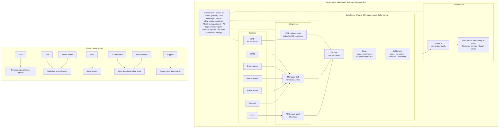

# Deliverable 1 — Architecture options comparison & recommendation

> Issue #2 · parent spec #1 · status: **recommendation, pending costing (#3)**
> Prices retrieved 2026-09-26. Scores live in [`analysis/`](../../analysis) and are recomputed with `python analysis/scoring.py`.

## 1. Recommendation (summary)

1. **Architecture: option D, a cloud lakehouse delivered datamart-first.** Build the first departmental mart (sales performance) as quickly as a datamart would allow, but on layered storage in an open format (raw → cleaned → business marts). Segmentation and inventory then plug into the same layers without re-platforming. D scores **78/100** and comes first in all three weighting scenarios (§4.3).
2. **Platform: Microsoft Fabric** (EU region) if the ERP is **Dynamics 365 Business Central**, scoring 86 against 80 for the runner-up. If the ERP is **SAP Business One**, Fabric, Snowflake and BigQuery come within 2 points of each other, which is inside the scoring error. In that case choose on the 3-year TCO from #3, keeping Fabric as the default because of the Power BI fit (§5).
3. **Tooling:** managed ELT (Fivetran, with Airbyte as fallback) for the SaaS sources; the ERP's native export path; **dbt** for all transformations; **Power BI** for BI; a **golden customer record built in the warehouse** (no separate CDP in the first three phases) (§6).
4. **Use-case order: Sales performance → Inventory optimization → Customer segmentation.** This **departs from the parent spec**, which put segmentation second. Inventory depends only on phase-1 data, while segmentation waits on MDM and GDPR consent work. The MDM groundwork starts in parallel from phase 1, so segmentation is not delayed by the change (§8).

## 2. Context and reference retailer

The brief (`b.pdf`) does not give the company's size. To make costs and effort comparable, the options are sized against the reference retailer below. These are **assumptions**, to be recalibrated when real figures are available (§9).

| Dimension | Assumption |
|---|---|
| Channels | ~30 physical stores + 1 webshop |
| Volumes | ~2 M POS order lines/yr, ~0.4 M online order lines/yr, ~0.3 M customer records across systems |
| Data volume | < 1 TB total after 3 years of history |
| BI users | ~10 report creators, ~60 report consumers |
| In-house data skills | 1–2 IT staff comfortable with SQL / SQL Server; no Spark or Python data engineering |
| ERP | Dynamics 365 Business Central **or** SAP Business One (the brief allows both; both cases are scored) |
| Jurisdiction | EU company, so GDPR applies to customer and web-analytics data |

## 3. Options considered

| | Option | What it looks like |
|---|---|---|
| **A** | On-premise departmental datamart | SQL Server + SSIS (Integration Services) on company servers; a star schema for sales; custom extract jobs for each SaaS API |
| **B** | Cloud warehouse used as a datamart | BigQuery or Snowflake; data loaded straight into a sales star schema; each later department gets its own mart |
| **C** | Full cloud lakehouse first | Databricks or Fabric; all 7 sources land in a raw layer and are conformed before any mart ships |
| **D** | Lakehouse, delivered datamart-first (hypothesis) | Same layered, open-format platform as C, but only the sources needed for the **first** mart are integrated first; other sources are added use case by use case |

## 4. Architecture decision

### 4.1 Criteria and weights

Scores run from 1 (poor) to 5 (best), and weights are percentages. The total is `Σ weight × score / 5`, out of 100.

Weights and qualitative scores (time-to-value, scalability, skills, lock-in, use-case scores) are **judgements**: each is argued in the text below, and the factual claims behind them (prices, connectors, licensing rules, integrations) are cited in §10. §4.3 shows the recommendation does not depend on the exact weights. The TCO row is qualitative until the costing deliverable (#3) replaces it with figures.

| Criterion | Baseline weight | Why this weight |
|---|---:|---|
| Time-to-value | 20 | The brief frames the choice as "datamart (faster to deliver) vs. full datalake". Speed is the stated trade-off, and early wins drive adoption (see change management, #7). |
| 3-year TCO | 20 | The costing deliverable (#3) compares TCO with the current situation, so it is a primary decision driver. |
| Scalability to 7 sources × 3 use cases | 15 | The goal is to centralize **all** siloed data; a solution that only fixes sales recreates silos. |
| Real-time POS support | 5 | POS is described as "real-time", but none of the three use cases needs sub-hour latency (daily sales, weekly segments, daily stock). It is a capability to keep available, not a driver. |
| GDPR & EU residency | 10 | A legal gate: every option must be able to pass it. The weight rewards options that make pseudonymization and erasure *easier*. |
| In-house skills | 10 | A small SQL team; every new skill set means hiring or training costs. |
| Vendor lock-in | 10 | 3-year horizon; exit costs matter but do not dominate at this scale. |
| ERP ecosystem fit | 10 | ERP is the master of product, stock and finance data. |

### 4.2 Scores

| Criterion | A on-prem mart | B cloud DW mart | C lakehouse first | D lakehouse, mart-first |
|---|:-:|:-:|:-:|:-:|
| Time-to-value | 3 | **5** | 2 | 4 |
| 3-year TCO | 2 | 3 | 3 | **4** |
| Scalability | 2 | 2 | **5** | 4 |
| Real-time POS | 2 | 4 | **5** | 4 |
| GDPR & EU | **4** | 3 | **4** | **4** |
| Skills | **5** | 4 | 2 | 4 |
| Lock-in | 3 | 2 | **4** | **4** |
| ERP fit | 3 | 3 | 3 | 3 |
| **Total (baseline)** | **58** | **66** | **66** | **78** |

Why each score:

- **Time-to-value.** A requires buying hardware and **hand-coding extractors** for six SaaS APIs. SSIS has no maintained connectors for Shopify, HubSpot or Zendesk, whereas managed ELT tools do (for example Fivetran's Shopify connector [9]). B is the fastest: serverless, with the star schema built directly. C delays the first dashboard until all seven sources are conformed. D matches B for the first mart, minus a small cost for building proper layers.
- **3-year TCO.** At this data volume, platform bills are small ($0–400/month, §5.2) and **people cost dominates**. A adds SQL Server licences ($3,945 per 2-core pack, 4-core minimum, so at least $7,890 [14]), hardware, patching and extractor upkeep. B is cheapest in year 1 but pays for **rework** when marts 2 and 3 need data that was loaded straight into sales-shaped tables. C needs up-front engineering for sources that deliver no value yet. D avoids both kinds of waste.
- **Scalability.** A and B repeat the department-by-department pattern the brief is trying to escape. C and D share layered storage; D scores 4 rather than 5 only because sources are onboarded progressively, not all at once.
- **Real-time POS.** Every cloud platform supports streaming or micro-batch ingestion (Fabric Eventstream, BigQuery Storage Write API, Snowpipe Streaming, Spark Structured Streaming); lakehouse engines are strongest. For A, streaming means custom work.
- **GDPR & EU.** All cloud vendors offer EU regions, which avoids third-country transfers and the Schrems II / transfer-tool analysis the EDPB requires [15]. C and D share one ordered pipeline: PII is pseudonymized once, in silver, and everything downstream is rebuilt from it. The raw (bronze) layer still holds identifiable data, so it needs restricted access (data engineers only), short retention, and erasure applied there first, after which silver and gold are rebuilt. That is manageable but not free, so C and D score 4, not 5. B scores 3 because each department mart holds its own copy of customer data, which means one erasure path per mart. A keeps data in-house but carries the whole security burden itself.
- **Skills.** A matches existing SQL Server skills best. B and D are SQL-first, since dbt models are SQL. C, as usually built, needs Spark or Python skills.
- **Lock-in.** B stores data in proprietary warehouse storage. C and D keep data in open table formats (Delta/Parquet in OneLake or ADLS) with portable dbt SQL. A is tied to Microsoft licensing but runs on company-owned hardware.
- **ERP fit.** Scored neutrally here, because it depends on the platform rather than the architecture; it decides the platform choice in §5.

### 4.3 Sensitivity

The ranking was recomputed under two alternative weightings (columns `w_speed_first` and `w_long_term` in [`architecture_scores.csv`](../../analysis/architecture_scores.csv)):

| Scenario | Weights changed | Ranking |
|---|---|---|
| Baseline | as above | **D 78** > B 66 = C 66 > A 58 |
| Speed first | time-to-value 35, scalability 5, lock-in 5 | **D 78** > B 75 > A 60 > C 58 |
| Long-term platform | scalability 25, lock-in 15, real-time 10, time-to-value 10 | **D 78** > C 76 > B 59 > A 54 |

D wins in every scenario, though its lead over C narrows to 2 points in the long-term weighting. The runner-up changes with the weighting: B if speed is all that matters, C if only the long term matters. D is the compromise that dominates both.

## 5. Platform choice for option D

Azure Synapse Analytics, named in the brief, is not scored separately. Microsoft provides migration guidance from Synapse to Fabric [17], and Fabric includes Synapse's warehouse and Spark engines, so for a new build Synapse is dominated by Fabric.

### 5.1 Scores

| Criterion | Weight | Fabric | BigQuery | Snowflake | Databricks |
|---|---:|:-:|:-:|:-:|:-:|
| ERP fit (Business Central) | 20 | **5** | 3 | 3 | 3 |
| BI fit (Power BI, §6.3) | 15 | **5** | 3 | 4 | 4 |
| Cost at this scale | 20 | 4 | **5** | 4 | 3 |
| dbt support | 10 | 3 | **5** | **5** | **5** |
| Streaming | 5 | 4 | 4 | 4 | **5** |
| Low-ops, SQL-first skills | 15 | 4 | 4 | **5** | 2 |
| Open storage / portability | 10 | 4 | 3 | 3 | **5** |
| EU region | 5 | 5 | 5 | 5 | 5 |
| **Total, ERP = Business Central** | | **86** | 78 | 80 | 72 |
| **Total, ERP = SAP Business One** (ERP fit = 3 for all) | | 78 | 78 | **80** | 72 |

Why each score:

- **ERP fit.** Microsoft documents a native Business Central → Fabric integration [4]. The *bc2adls* extension exports BC tables incrementally to OneLake or ADLS [5]. For SAP Business One (running on SQL Server or SAP HANA), every platform reads it through a database connector, so there is no differentiator.
- **BI fit.** Power BI is chosen on its own merits, independently of the platform (§6.3: lowest price per user, and the Excel-familiar users it suits). Given Power BI, Fabric fits best because Power BI reads Fabric data directly (Direct Lake) and bills on the same Microsoft account. Snowflake and Databricks have well-supported Power BI connectors. BigQuery works with Power BI, but Google's own tooling steers towards Looker, so it scores 3.
- **Cost at this scale** (details in §5.2). BigQuery is pay-per-query and almost free at < 1 TB. Fabric bills a fixed capacity; Snowflake bills per second with auto-suspend; Databricks adds DBU pricing and more settings to manage.
- **dbt.** BigQuery, Snowflake and Databricks have mature dbt adapters. Fabric's adapter, maintained by Microsoft, targets Fabric Data Warehouse [13], and a lakehouse adapter is announced but not generally available, so Fabric scores 3. In practice this means raw (bronze) data lands in a Fabric **Lakehouse**, and dbt builds silver and gold in a Fabric **Warehouse**. The Warehouse also stores its tables as Delta Parquet in OneLake [18], so the whole stack stays in an open format.
- **Skills.** Snowflake is the lowest-ops option for SQL users. Fabric Warehouse uses T-SQL, which fits a SQL Server team. Databricks is notebook- and Spark-oriented.
- **Openness.** Databricks is built around open Delta and Unity Catalog. Fabric stores everything as Delta in OneLake. Snowflake (Iceberg tables) and BigQuery (BigLake) support open formats as an extra, not by default.

### 5.2 Indicative platform run costs (list prices, to be finalised in #3)

| Item | Calculation | ≈ per month |
|---|---|---:|
| Fabric F2, pay-as-you-go, West Europe | 2 CU × $0.22/CU-h × 730 h [1] | $321 |
| Fabric F2, 1-year reservation | 2 CU × $1,146/CU-yr ÷ 12 [1] | $191 |
| Fabric F4, 1-year reservation | 4 CU × $1,146/CU-yr ÷ 12 [1] | $382 |
| OneLake storage, 1 TB hot | 1,000 GB × $0.024 [1] | $24 |
| BigQuery, 1 TB storage + 3 TiB scanned | 1,024 GiB × $0.023 + (3 − 1 free) TiB × $6.25 (EU multi-region) [6] | ≈ $36 |
| Snowflake, XS warehouse 4 h/day | 120 credits × ~$2.40–2.80 (Standard, EU estimate) [7] | ≈ $290–340 |
| Databricks SQL Serverless | ~$0.91/DBU in EU regions [8]; DBU/h per warehouse size to be confirmed in #3 | TBD |

**Takeaway.** Platform bills differ by a few hundred dollars a month, while one data engineer costs thousands. The platform decision should therefore turn on **ERP and BI fit and the skills the team already has**, not on list prices. That is why "cost" is only one of eight criteria.

## 6. Supporting tools

### 6.1 Ingestion (ELT)

| | Fivetran | Airbyte | Custom scripts |
|---|---|---|---|
| Pricing | Monthly Active Rows; free tier up to 500k MAR; Standard plan with 15-minute syncs [9] | Open-source *Core* is free to self-host; Cloud Standard from $20/month (volume credits), with syncs at most hourly [10] | No licence; engineering time |
| Connectors | 700+, maintained by the vendor [9] | 700+ (Cloud Standard) [10] | Built and maintained in-house |
| Ops burden | Lowest | Low (Cloud) / medium (self-hosted) | Highest: API changes break the pipelines |
| Fit here | **Recommended** for CRM, e-commerce, support, web analytics and social sources: volumes are small, and connector upkeep is the hidden cost | **Fallback** if #3 shows MAR costs too high; the self-hosted version removes vendor lock-in | Only for the POS vendor if it has no connector (for example SFTP file drops) |

**ERP path.** For Business Central, use the Fabric integration or bc2adls [4][5], which needs no ELT licence. For SAP Business One, use a database connector (SQL Server / HANA) through the ELT tool.

**Action for #3.** Confirm that the chosen tool has connectors for the specific social platforms (Instagram, Facebook, TikTok) and POS vendor, and estimate MAR for each source.

### 6.2 Transformation: dbt

dbt holds all business logic as version-controlled SQL with tests, documentation and lineage. This covers spec user stories 22, 23 and 25, and the same models run on every platform scored above, which is the main guard against lock-in. dbt Core is open source; with Fabric, dbt jobs can also run inside Fabric [13]. No alternative is seriously considered: vendor-native transformation tools (Dataflows, notebooks) would tie the business logic to one platform.

### 6.3 BI

| | Power BI | Tableau | Looker |
|---|---|---|---|
| List price | Pro $14/user/month; PPU $24 [3] | Cloud Standard: Creator $75, Explorer $42, Viewer $15 per user/month [11] | Quote-based; third-party analyses report ~$60k+/yr for the platform plus per-user fees [12]; Looker Studio Pro $9/user |
| ~70 users/year | 70 × $14 × 12 ≈ **$11.8k** | 2 Creator + 8 Explorer + 60 Viewer ≈ **$16.6k** | ≈ **$60k+** |
| Fit | Native to Fabric and Business Central; Excel-familiar users | Strong visual exploration | Strong semantic layer (LookML), priced for larger organizations |

**Recommendation: Power BI.** It is chosen independently of the platform, on the lowest price per user (about 30% below Tableau for this user mix and far below Looker) and on familiarity for Excel-based merchandising and sales teams. That choice then counts in Fabric's favour in §5.1. Note: with a Fabric capacity **below F64**, every report viewer still needs a Pro licence; only at F64 and above can free users view content [16]. F64 reserved costs about 64 × $1,146 ≈ $73k/yr, which only beats buying Pro licences above roughly 440 viewers. So stay on F2/F4 and buy Pro for ~70 users.

### 6.4 CDP: Segment vs. golden record in the warehouse

| | Segment (packaged CDP) | Golden record built in the warehouse |
|---|---|---|
| What it does | Collects events and resolves identity outside the warehouse; activates segments to ad and email tools in real time | Identity resolution as dbt models over the cleaned (silver) layer; segments are tables |
| Cost | Separate subscription priced on tracked users | No extra licence |
| GDPR | A second copy of customer PII with its own erasure path | One copy, one erasure path (§4.2) |
| Fit here | Only needed if marketing requires **real-time activation** | **Recommended.** Segmentation in the brief is analytical (campaign targeting), not real-time |

Revisit this after phase 3 if marketing asks for real-time personalization. The golden-record tables can then feed a CDP rather than be replaced by one.

## 7. Target architecture

The transformations between bronze, silver and gold are dbt models. Bronze is readable only by data engineers; only gold is exposed to BI.

## 8. Use-case prioritization

### 8.1 Scores

| Criterion | Weight | Sales performance | Inventory optimization | Customer segmentation |
|---|---:|:-:|:-:|:-:|
| Business value | 25 | 4 | **5** | 4 |
| Data readiness | 25 | **5** | 4 | 2 |
| Dependencies on other work | 20 | **5** | 4 | 2 |
| GDPR exposure (5 = low) | 10 | **5** | **5** | 2 |
| Visibility & adoption | 20 | **5** | 3 | 4 |
| **Total** | | **95** | **83** | **58** |

Why each score:

- **Sales performance first** (95). It uses the most structured sources (POS, e-commerce, ERP). It needs **no** customer identity resolution, since it reports by store, channel, product and period. It has the largest audience across Sales, E-commerce and management, and it replaces the most reconciled-by-hand reports. That makes it the quick win change management needs (#7).
- **Inventory optimization second** (83). It has the highest direct financial impact: stock-outs lose sales and overstock ties up working capital. It needs only ERP stock data plus the **cross-channel demand already built** for sales, and it involves no personal data. Its visibility is lower because only supply chain and purchasing use it.
- **Customer segmentation third** (58). It depends on the **golden customer record** (MDM across POS loyalty, e-commerce, CRM and support IDs), on **consent** handling, and on GDPR controls (#5). This is the hardest data-quality and legal work, and it is the one most likely to slip.

### 8.2 How this differs from the parent spec

The parent spec (#1) put segmentation second, following the order in which the brief lists the use cases. The scoring shows that inventory is cheaper and safer to deliver second. The effect on the schedule is limited, because:

- **MDM and governance work (#5) starts in phase 1** and runs in parallel, so segmentation starts from mature matching rules.
- **Daily stock snapshots must start in phase 1** in any case. ERPs usually keep only *current* stock, so history only exists from the day snapshotting begins. Starting early gives inventory optimization months of history by the time it is built.

The transformation plan (#6) should adopt this order. The PoC issues are unaffected: #12 (inventory) already depends only on #9 (sales).

## 9. Assumptions to validate

| # | Assumption | Effect if wrong |
|---|---|---|
| 1 | The reference retailer size in §2 | Larger volumes (for example > 10 TB, or hundreds of BI viewers) favour Databricks/Snowflake compute and F64 capacity; rerun §5 |
| 2 | ERP is Business Central | With SAP B1, the platform choice becomes a near tie (§5.1); decide on #3's TCO |
| 3 | The team is SQL-skilled, with no Spark | With Python/Spark skills (skills score 2 → 4), C rises to 70 and Databricks to 78; D (78) and Fabric (86) still come first |
| 4 | No use case needs sub-hour latency | If real-time store replenishment is required, raise the real-time weight; C or D with streaming, still not A or B |
| 5 | Customers are in the EU and no data leaves the EU region | Any US-hosted SaaS in the chain (ELT, CDP) needs a transfer assessment [15] |
| 6 | Prices in §5.2 and §6 are current list prices | Replace with quotes in #3; update the `tco_3y` / `cost_small_scale` rows in the `analysis/` CSVs and rerun `python analysis/scoring.py` |
| 7 | Power BI users: about 10 creators + 60 viewers | Above ~440 viewers, F64 capacity beats per-user Pro licences [16] |

## 10. Sources

Retrieved 2026-09-26 unless noted. Where the vendor page could not be read directly, the secondary source used is named; confirm those prices in #3.

1. Azure Retail Prices API, service "Microsoft Fabric", region westeurope: capacity $0.22/CU-hour pay-as-you-go, $1,146/CU per year for a 1-year reservation, OneLake hot storage $0.024/GB-month. `https://prices.azure.com/api/retail/prices?$filter=serviceName eq 'Microsoft Fabric' and armRegionName eq 'westeurope'`
2. Microsoft Fabric pricing: https://azure.microsoft.com/en-us/pricing/details/microsoft-fabric/
3. Power BI pricing (Pro $14, PPU $24 per user/month, paid yearly): https://www.microsoft.com/en-us/power-platform/products/power-bi/pricing
4. Microsoft Learn, *Introduction to Microsoft Fabric and Business Central*: https://learn.microsoft.com/en-us/dynamics365/business-central/admin-fabric
5. bc2adls on Microsoft Marketplace: https://marketplace.microsoft.com/en-us/product/pubid.bc2adls01%7caid.bc2adls%7cpappid.7a4530b3-2449-40ad-9779-97f4663ce51f
6. BigQuery pricing: https://cloud.google.com/bigquery/pricing. The page did not render for extraction; figures ($6.25/TiB EU multi-region, $7.50/TiB europe-west1, first 1 TiB/month free, $0.023/GiB active storage) come from https://airbyte.com/data-engineering-resources/bigquery-pricing and https://github.com/BenchBox-dev/BenchBox/pull/2194. Confirm in #3.
7. Snowflake pricing: https://www.snowflake.com/en/pricing-options/ and the credit consumption table https://www.snowflake.com/legal-files/CreditConsumptionTable.pdf. Standard edition $2.00/credit in US AWS regions and the EU premium estimate come from https://select.dev/posts/snowflake-pricing and https://www.flexera.com/blog/finops/ultimate-snowflake-cost-optimization-guide-reduce-snowflake-costs-pay-as-you-go-pricing-in-snowflake/
8. Azure Databricks pricing: https://azure.microsoft.com/en-us/pricing/details/databricks/. The EU SQL Serverless rate (~$0.91/DBU) comes from https://www.revefi.com/blog/databricks-pricing-guide
9. Fivetran pricing (MAR, free tier 500k MAR, Standard 15-minute syncs, 700+ connectors): https://www.fivetran.com/pricing. Shopify connector: https://fivetran.com/docs/connectors/applications/shopify
10. Airbyte pricing (Core open source; Cloud Standard from $20/month, 5 credits included): https://airbyte.com/pricing
11. Tableau pricing: https://www.tableau.com/pricing/teams-orgs (returned 403); figures from https://mammoth.io/blog/tableau-pricing/
12. Looker pricing: https://cloud.google.com/looker/pricing (quote-based); platform estimate from https://www.luzmo.com/blog/looker-pricing
13. dbt on Fabric: https://learn.microsoft.com/en-us/fabric/data-warehouse/tutorial-setup-dbt, https://github.com/microsoft/dbt-fabric, https://learn.microsoft.com/en-us/fabric/data-factory/dbt-job-overview
14. SQL Server 2022 licensing ($3,945 per Standard 2-core pack, 4-core minimum): https://redmondmag.com/articles/2022/11/16/sql-server-2022-every-licensing.aspx
15. EDPB, *International data transfers*: https://www.edpb.europa.eu/sme/be-compliant/international-data-transfers_en
16. Microsoft Learn, *Understand Microsoft Fabric licenses and capacity* ("On F SKUs smaller than F64, each user viewing Power BI content must have Pro, PPU, or an individual trial"): https://learn.microsoft.com/en-us/fabric/enterprise/licenses
17. Microsoft Learn, *Migration: Azure Synapse Analytics to Fabric*: https://learn.microsoft.com/en-us/fabric/data-engineering/migrate-synapse-overview
18. Microsoft Learn, *What is data warehousing in Microsoft Fabric?* (Warehouse tables stored in Delta Parquet in OneLake): https://learn.microsoft.com/en-us/fabric/data-warehouse/data-warehousing
