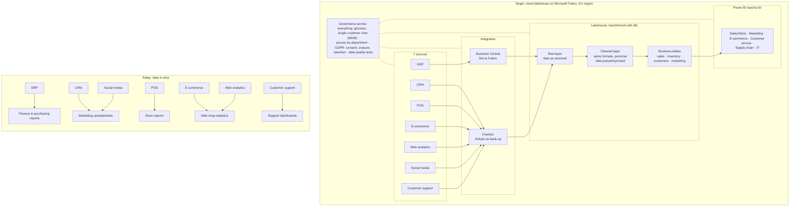

# Part 1: Choosing the architecture

*Case 6: Urbanization, Datamart / Datalake (multi-channel distribution)*

## 1. What we are asked to decide

The company sells through physical stores and online, and its data sits in seven separate systems:

| Source (from the brief) | Examples in the brief | What it contains |
|---|---|---|
| ERP | SAP Business One or Microsoft Dynamics 365 Business Central (formerly Dynamics NAV) | inventory, finance, procurement |
| CRM | Salesforce or HubSpot | customer interactions, campaigns |
| POS | local store tills | real-time store sales |
| E-commerce | Shopify or Magento | online orders, customer behaviour |
| Web analytics | Google Analytics, Facebook Pixel | traffic, conversion rates |
| Social media | Instagram, Facebook, TikTok | engagement metrics |
| Customer support | Zendesk or Freshdesk | tickets, feedback |

The brief says the data is **"siloed across platforms with different formats and update frequencies"**. The goal is to **centralize and structure it** for three uses: sales performance analysis, customer segmentation and inventory optimization.

The brief asks us to choose:

1. **the architecture:** a *departmental datamart* ("faster to deliver") or a *full datalake/lakehouse*;
2. **the technology:** *cloud* or *on-premise*;
3. **the tools**, from the technical stack it proposes;
4. **which use case comes first.**

### Definitions we use

- **Datamart:** a small database built for one department (for example sales), already organized into ready-to-use tables. It is quick to build but covers only one subject.
- **Data lake:** a central store that keeps data from every source in its raw form, in any format. It is flexible, but raw data is hard for business users to work with directly.
- **Lakehouse:** a data lake with a structured layer on top. Data is stored once, then cleaned and organized in layers (raw → cleaned → business tables), so it can serve every department.

## 2. Our assumptions

The brief does not give the company's size, so we assume a medium-sized retailer:

- about 30 stores and one webshop;
- about 2 million store sales lines and 0.4 million online order lines per year;
- less than 1 TB of data after 3 years;
- about 70 people reading reports, 10 of whom build them;
- a small IT team that knows SQL but not big-data tools;
- a company in the EU, so the **GDPR** applies, as the brief notes.

## 3. The four options

Crossing the two choices in the brief gives four options:

| | Departmental datamart | Datalake / lakehouse |
|---|---|---|
| **On-premise** | ① Datamart on-premise | ③ Lakehouse on-premise |
| **Cloud** | ② Datamart cloud | ④ Lakehouse cloud |

## 4. How we compare them

We took each criterion **from the brief itself**, so that the choice answers what was asked:

| Criterion | Where it comes from in the brief | Weight |
|---|---|---:|
| Speed of delivery | "departmental datamart (**faster to deliver**)" | 20 |
| Integrating the 7 sources | "consolidating the seven heterogeneous sources … each with different formats and refresh frequencies" | 20 |
| Covers the 3 use cases | "centralize and structure this data for sales performance analysis, customer segmentation, and inventory optimization" | 15 |
| Governance & GDPR | "master data management for a single customer view … GDPR compliance for customer and web-analytics data" | 15 |
| Self-service for business teams | "training merchandising/marketing/sales teams on self-service analytics" | 10 |
| Cost | "Full costing (investment + operating cost)" | 20 |

Each option gets a score from 1 (bad) to 5 (very good). The total, out of 100, is the weighted score: `Σ weight × score / 5`.

Speed, integration and cost get the highest weights (20 each), because the brief sets up the whole choice as a trade-off between speed and centralizing everything, and it asks for a full costing. The other criteria still matter, but they depend on the choice more than they drive it.

## 5. Results

| Criterion | Weight | ① Datamart on-prem | ② Datamart cloud | ③ Lakehouse on-prem | ④ Lakehouse cloud |
|---|---:|:-:|:-:|:-:|:-:|
| Speed of delivery | 20 | 3 | **5** | 1 | 3 |
| Integrating the 7 sources | 20 | 2 | 3 | 3 | **5** |
| Covers the 3 use cases | 15 | 2 | 2 | 4 | **5** |
| Governance & GDPR | 15 | 3 | 2 | **4** | **4** |
| Self-service | 10 | 3 | **4** | 3 | **4** |
| Cost | 20 | 2 | **5** | 1 | 4 |
| **Total / 100** | | **49** | **72** | **50** | **83** |

### Why we gave these scores

- **Speed.** The brief itself says the datamart is faster. In the cloud there is no hardware to buy, so ② is the fastest. On-premise needs servers to be bought and installed first. An on-premise lakehouse (③) is the slowest, because it needs a big-data cluster and specialists we don't have.
- **Integrating the 7 sources.** A datamart expects clean tables organized for one subject. Web analytics and social media data arrive as semi-structured data (JSON) through APIs, at different frequencies. A lakehouse is made for this: it first stores everything raw, then cleans it. The brief's ETL tools (Fivetran, Airbyte) offer ready-made connectors for these SaaS sources (for example Fivetran's Shopify connector [9]) and are built for cloud destinations. That is why ④ gets 5.
- **Covers the 3 use cases.** A departmental datamart only serves one department. To cover sales, marketing and supply chain we would have to build three datamarts, which **recreates the silos** the brief wants to remove. A lakehouse holds all the data in one place.
- **Governance & GDPR.** To get a single customer view (MDM), customer data from POS, e-commerce, CRM and support must be matched in **one place**. Several datamarts mean several copies of personal data, so more places to protect and to delete from when a customer asks (the GDPR right to erasure). In the cloud we can choose an EU region, which avoids transferring data outside the EU [15].
- **Self-service.** Business users never see the raw data in either case; they use the final tables through a BI tool. Cloud BI tools connect directly to cloud platforms, whereas on-premise needs an extra gateway.
- **Cost.** On-premise means buying servers and licences upfront, for example SQL Server Standard at $3,945 per 2 cores [14], plus people to maintain them. In the cloud you pay only for what you use. For a data volume like ours, cloud platforms cost from a few dozen to a few hundred dollars a month (§7). The cloud datamart is the cheapest at the start; the lakehouse costs a little more because it holds more data. The detailed costing is done in Part 3.

### Does the result change if we change the weights?

We tested a second weighting where **speed is the priority** (speed 35, cost 25, integration 15, use cases 5):

| Weighting | Result |
|---|---|
| Our weighting (§4) | **④ Lakehouse cloud 83** > ② Datamart cloud 72 > ③ 50 > ① 49 |
| Speed first | **② Datamart cloud 83** > ④ Lakehouse cloud 77 > ① 51 > ③ 39 |

So **if speed were the only goal, the cloud datamart would win**. But the brief's goal is to *centralize* all seven sources for three use cases, not only to deliver one report quickly. Also, cloud always beats on-premise in both weightings.

## 6. Our choice: a cloud lakehouse, delivered use case by use case

We choose **option ④, a lakehouse in the cloud**.

To keep the advantage of the datamart (speed), we **will not build everything at once**. We start with the sources needed for the first use case, then add the others step by step (§9). This way the first reports arrive quickly, and every step reuses the same platform instead of creating a new silo.

## 7. Which cloud platform?

The brief proposes four platforms: **Snowflake, Google BigQuery, Azure Synapse/Fabric, Databricks**. For Azure we look at **Fabric**: it is Microsoft's newer platform, and Microsoft provides guides for moving from Synapse to Fabric [17].

| Criterion | Weight | Fabric | BigQuery | Snowflake | Databricks |
|---|---:|:-:|:-:|:-:|:-:|
| Fits the ERP (we assume Dynamics 365 BC) | 20 | **5** | 3 | 3 | 3 |
| Works with the brief's ETL tools (Fivetran, Airbyte, dbt) | 15 | 3 | **5** | **5** | **5** |
| Works with Power BI (our BI choice, §8) | 15 | **5** | 3 | 4 | 4 |
| Is a real lakehouse | 15 | 4 | 3 | 3 | **5** |
| Cost at our size | 20 | 4 | **5** | 4 | 3 |
| Easy for a small SQL team | 15 | 4 | 4 | **5** | 2 |
| **Total / 100** | | **84** | 77 | 79 | 72 |

- **ERP.** The brief allows two ERPs. We assume **Dynamics 365 Business Central**, since Microsoft documents a direct connection between Business Central and Fabric [4], and the bc2adls extension exports Business Central tables to Fabric [5]. **If the company uses SAP Business One instead**, that advantage disappears and Snowflake comes first (Snowflake 79, BigQuery 77, Fabric 76). The three are then very close, and the costing in Part 3 should decide.
- **ETL tools.** dbt works well on BigQuery, Snowflake and Databricks. On Fabric, the dbt adapter works with the Fabric *Warehouse* [13]. That is fine for us: Fabric Warehouse tables are stored in the open Delta/Parquet format in OneLake, like the lakehouse [18].
- **Lakehouse.** Databricks invented the lakehouse model (the brief even writes "Databricks (lakehouse)"). Fabric stores everything in open Delta tables in OneLake. BigQuery and Snowflake are data warehouses first.
- **Cost.** BigQuery charges per query, which is almost free at our size (about $36/month for 1 TB stored and 3 TiB queried [6]). Fabric's smallest capacity, F2, costs about $191/month with a 1-year reservation in West Europe [1][2]. Snowflake costs about $290–340/month for a small warehouse running 4 hours a day [7]. Databricks has more complex pricing [8]. These amounts are small compared with the cost of one employee.
- **Ease.** Snowflake is the simplest for SQL users. Databricks is built around notebooks and Spark, which our team doesn't know.

**Choice: Microsoft Fabric**, in an EU region.

## 8. The other tools (from the brief's stack)

### ETL/ELT: Fivetran or Airbyte, plus dbt

| | Fivetran | Airbyte |
|---|---|---|
| Model | Fully managed; price based on rows changed per month (MAR); free tier up to 500,000 MAR [9] | Open source (free if we host it ourselves) or cloud from $20/month [10] |
| Connectors | 700+ [9] | 700+ [10] |
| Refresh | Every 15 minutes (Standard plan) [9] | At most every hour (Cloud Standard) [10] |

**Choice: Fivetran** to load the SaaS sources (CRM, e-commerce, web analytics, social media, support). Our volumes are small, so the price stays low, and it maintains the connectors for us. **Airbyte** is our back-up option if Part 3 shows Fivetran is too expensive.

**dbt** is used for every transformation (raw → cleaned → business tables). Transformations become SQL files with tests and documentation, and they would also run on the other platforms if the company changed later.

### BI: Power BI, Tableau or Looker

| | Power BI | Tableau | Looker |
|---|---|---|---|
| Price | Pro: $14/user/month [3] | Viewer $15, Explorer $42, Creator $75 per user/month [11] | Price on quote, estimated at $60,000+/year [12] |
| Cost for our ~70 users | ≈ $11,800/year | ≈ $16,600/year | ≈ $60,000+/year |

**Choice: Power BI.** It is the cheapest per user and familiar to people who use Excel, which helps with the change management the brief asks for. We chose it **before** the platform, based on price and users. Its good fit with Fabric is then a point in Fabric's favour, not the reason we chose Power BI.

Note: with a small Fabric capacity (below F64), every report reader still needs a Pro licence [16]. F64 costs about $73,000/year, so it is only worth it above about 440 readers. We stay on a small capacity.

### Customer Data Platform (optional in the brief): Segment or a native CDP

The brief suggests "Segment, or a native CDP for a unified customer view". We choose to build the **single customer view inside the lakehouse** (matching customers across sources with dbt) rather than buying Segment. Our segmentation is for analysis and campaign targeting, not real-time personalization, so Segment's main advantage isn't needed. It would also create a second copy of personal data, which is worse for GDPR.

## 9. Which use case first?

The brief lists three use cases and asks us to sequence them. We scored them:

| Criterion | Weight | Sales performance | Inventory optimization | Customer segmentation |
|---|---:|:-:|:-:|:-:|
| Business value | 25 | 4 | **5** | 4 |
| Data available and clean | 25 | **5** | 4 | 2 |
| Depends on other work | 20 | **5** | 4 | 2 |
| Low GDPR risk | 10 | **5** | **5** | 2 |
| Visible to many users | 20 | **5** | 3 | 4 |
| **Total / 100** | | **95** | **83** | **58** |

**Our order: 1) Sales performance → 2) Inventory optimization → 3) Customer segmentation.**

1. **Sales performance first.** It uses the most structured sources (POS, e-commerce, ERP). It needs no single customer view, since reports are by store, channel, product and date. It interests the most people: sales, stores, e-commerce and management. It is a quick win that helps convince teams to give up their own channel reports (the resistance the brief mentions).
2. **Inventory optimization second.** It has the biggest financial impact: avoiding stock-outs and overstock. It only needs ERP stock data plus the sales data already loaded in step 1, and it contains no personal data. We should **start saving a daily copy of stock levels from step 1**, because an ERP usually keeps only today's stock, and we will need history.
3. **Customer segmentation last.** It requires the single customer view (MDM) and GDPR consent management, which is the most difficult work. We start preparing the MDM rules during step 1, so it is ready in time.

## 10. Target architecture

Only the IT team can read the raw layer. Business users only see the business tables through Power BI.

## 11. Limits of our analysis

- **Scores are our own judgement.** We explain each one and cite our sources for the facts (prices, compatibilities), but another group could give different scores. §5 shows that cloud beats on-premise in both weightings we tested, while datamart vs lakehouse depends on how much weight we give speed.
- **The company's size is assumed** (§2). With much more data or many more report readers, the costs and maybe the platform choice would change.
- **The ERP is assumed to be Business Central.** With SAP Business One, Snowflake, BigQuery and Fabric are almost equal (§7).
- **Prices are public list prices** checked on 26 September 2026. Some come from secondary sources because the vendor's page could not be read. Part 3 (costing) must check them.

To recompute the scores after changing a weight or a score: `python analysis/scoring.py` (the files are in `analysis/`).

## Sources

1. Azure Retail Prices API, Microsoft Fabric, West Europe (capacity $0.22 per CU-hour pay-as-you-go, $1,146 per CU per year with a 1-year reservation; OneLake storage $0.024/GB/month): `https://prices.azure.com/api/retail/prices?$filter=serviceName eq 'Microsoft Fabric' and armRegionName eq 'westeurope'`
2. Microsoft Fabric pricing: https://azure.microsoft.com/en-us/pricing/details/microsoft-fabric/
3. Power BI pricing (Pro $14, Premium Per User $24 per user/month): https://www.microsoft.com/en-us/power-platform/products/power-bi/pricing
4. Microsoft Learn, *Introduction to Microsoft Fabric and Business Central*: https://learn.microsoft.com/en-us/dynamics365/business-central/admin-fabric
5. bc2adls (export of Business Central data to Fabric/Data Lake): https://marketplace.microsoft.com/en-us/product/pubid.bc2adls01%7caid.bc2adls%7cpappid.7a4530b3-2449-40ad-9779-97f4663ce51f
6. BigQuery pricing: https://cloud.google.com/bigquery/pricing. Figures ($6.25/TiB in the EU multi-region, first TiB free each month, $0.023/GiB storage) come from https://airbyte.com/data-engineering-resources/bigquery-pricing because the Google page could not be read.
7. Snowflake pricing: https://www.snowflake.com/en/pricing-options/. The price per credit ($2.00 Standard in the US, more in the EU) comes from https://select.dev/posts/snowflake-pricing
8. Azure Databricks pricing: https://azure.microsoft.com/en-us/pricing/details/databricks/
9. Fivetran pricing: https://www.fivetran.com/pricing. Shopify connector: https://fivetran.com/docs/connectors/applications/shopify
10. Airbyte pricing: https://airbyte.com/pricing
11. Tableau pricing (the official page https://www.tableau.com/pricing/teams-orgs could not be read), figures from https://mammoth.io/blog/tableau-pricing/
12. Looker pricing (on quote): https://cloud.google.com/looker/pricing. Estimate from https://www.luzmo.com/blog/looker-pricing
13. Microsoft Learn, *Set up dbt for Fabric Data Warehouse*: https://learn.microsoft.com/en-us/fabric/data-warehouse/tutorial-setup-dbt
14. SQL Server 2022 licensing ($3,945 per Standard 2-core pack): https://redmondmag.com/articles/2022/11/16/sql-server-2022-every-licensing.aspx
15. European Data Protection Board, *International data transfers*: https://www.edpb.europa.eu/sme/be-compliant/international-data-transfers_en
16. Microsoft Learn, *Understand Microsoft Fabric licenses and capacity*: https://learn.microsoft.com/en-us/fabric/enterprise/licenses
17. Microsoft Learn, *Migration: Azure Synapse Analytics to Fabric*: https://learn.microsoft.com/en-us/fabric/data-engineering/migrate-synapse-overview
18. Microsoft Learn, *What is data warehousing in Microsoft Fabric?*: https://learn.microsoft.com/en-us/fabric/data-warehouse/data-warehousing
